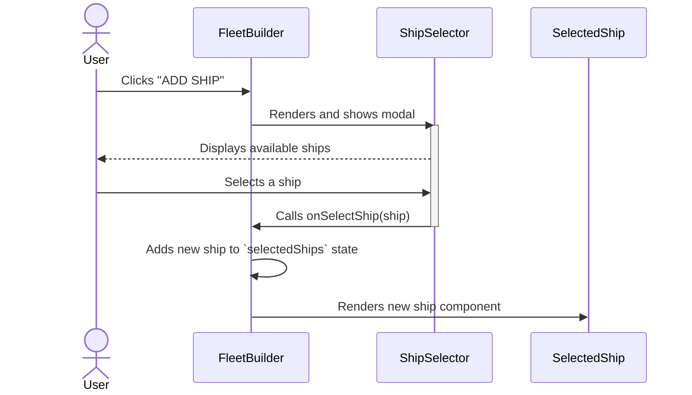
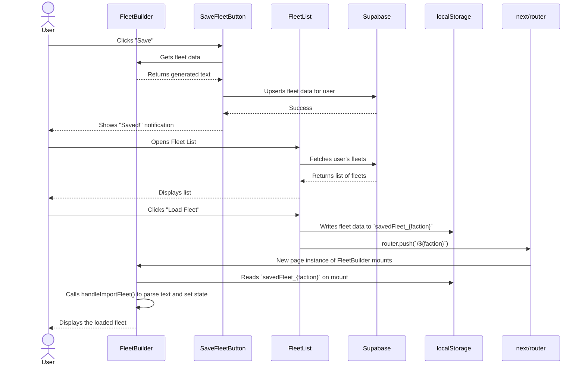

# Application Architecture Documentation

This document provides an overview of the application's component architecture, data flow, and key component responsibilities.

### Component Architecture Overview

The application is built around a few central components that manage state and user interactions. The `FleetBuilder` acts as the main orchestrator, holding the state of the fleet being built. Other components, like selectors and display cards, are rendered by `FleetBuilder` and communicate back to it via props and callbacks.

Here is a high-level diagram of the component architecture:

```mermaid
graph TD
    subgraph Page
        A[FleetBuilder]
        B[ContentToggleButton]
    end

    subgraph "Fleet Display"
        A --> C{SelectedShip}
        A --> D{SelectedSquadron}
        A --> E{SwipeableObjective}
    end

    subgraph "Selectors (Modals)"
        F[ShipSelector]
        G[SquadronSelector]
        H[ObjectiveSelector]
        I[UpgradeSelector]
    end

    subgraph "Toolbar & Actions"
        J[SaveFleetButton]
        K[ExportTextPopup]
        L[PrintMenu]
        M[FleetList]
    end

    A -- "Opens" --> F
    A -- "Opens" --> G
    A -- "Opens" --> H
    C -- "Opens" --> I
    D -- "Opens" --> I
    A -- "Opens" --> K
    A -- "Opens" --> L
    A -- "Interacts with" --> J
    B -- "Triggers Content Reload" --> Page

    style Page fill:#f9f,stroke:#333,stroke-width:2px
    style "Fleet Display" fill:#ccf,stroke:#333,stroke-width:2px
    style "Selectors (Modals)" fill:#cfc,stroke:#333,stroke-width:2px
    style "Toolbar & Actions" fill:#fec,stroke:#333,stroke-width:2px
```

---

### Core Components Documentation

#### 1. `FleetBuilder.tsx`

This is the heart of the application. It's a stateful component that manages the entire fleet composition.

*   **Responsibilities:**
    *   Maintains the state for `selectedShips`, `selectedSquadrons`, and `selectedObjectives`.
    *   Calculates total fleet points and squadron points.
    *   Renders the list of selected ships and squadrons using `SelectedShip` and `SelectedSquadron` components.
    *   Handles the logic for opening and closing selector modals (`ShipSelector`, `SquadronSelector`, `UpgradeSelector`, etc.).
    *   Contains the callback functions that update the fleet state when a user adds, removes, or modifies a ship, squadron, or upgrade.
    *   Generates the fleet text for exporting and saving.
    *   Manages fleet recovery from `localStorage` on page load.
    *   Checks the fleet against `gamemodeRestrictions` for validation.

*   **Interactions:**
    *   Receives `faction` and `gamemode` from the parent page.
    *   Passes data and callbacks down to child components like `SelectedShip` and `ShipSelector`.
    *   Uses `useUniqueClassContext` to track and enforce rules for unique cards across the entire fleet.

#### 2. `ContentToggleButton.tsx`

This component allows the user to customize the content available in the selectors.

*   **Responsibilities:**
    *   Provides UI toggles for different content packs (e.g., Legacy, Legends, Nexus).
    *   Provides a dropdown to select the game mode (e.g., Standard, Task Force, Unrestricted).
    *   Saves the user's choices to browser cookies to persist them across sessions.
    *   Triggers a global content reload (`forceReloadContent`) when settings are changed.

*   **Interactions:**
    *   Reads and writes to `js-cookie`.
    *   Applies restrictions from `gamemodeRestrictions` to disable or force certain content toggles.
    *   Its changes indirectly affect all selector components (`ShipSelector`, `SquadronSelector`, etc.) by forcing a data refresh into `localStorage`.

#### 3. Selector Components (`ShipSelector.tsx`, `SquadronSelector.tsx`, `ObjectiveSelector.tsx`, `UpgradeSelector.tsx`)

These components are modals used to add items to the fleet. They share a similar pattern.

*   **Responsibilities:**
    *   Fetch and display a list of available items (ships, squadrons, etc.) based on the current faction and enabled content sources.
    *   Read data primarily from `localStorage`, which is populated by the content management system.
    *   Provide search and sort functionality.
    *   Disable items that are not allowed by the current `gamemodeRestrictions` or are already present in the fleet (in the case of unique cards).

*   **Interactions:**
    *   Opened by `FleetBuilder`.
    *   When a user selects an item, they call a callback function (e.g., `onSelectShip`) passed down from `FleetBuilder` to update the main fleet state.

#### 4. Selected Item Components (`SelectedShip.tsx`, `SelectedSquadron.tsx`)

These components display a single ship or squadron that has been added to the fleet.

*   **Responsibilities:**
    *   Display the card image, name, points, and other relevant stats.
    *   For `SelectedShip`, it renders the `UpgradeIconsToolbar` to manage upgrades.
    *   Provides UI for removing, copying, or re-ordering the item.
    *   For `SelectedSquadron`, it handles incrementing/decrementing the count of non-unique squadrons.
    *   Implements swipe gestures on mobile for quick actions.

*   **Interactions:**
    *   Receives its data (`ship` or `squadron` object) from `FleetBuilder`.
    *   Calls callbacks passed from `FleetBuilder` to handle removal, copying, or upgrade clicks.

#### 5. `FleetList.tsx` & `SaveFleetButton.tsx`

These components handle the persistence of fleets for users.

*   **Responsibilities:**
    *   `SaveFleetButton`: Saves the current fleet state to a Supabase database. It handles both logged-in and anonymous users.
    *   `FleetList`: Fetches and displays a list of saved fleets from Supabase for the logged-in user. It provides actions to load, delete, or share a fleet.

*   **Interactions:**
    *   Both use `useUser` from Auth0 to check authentication status.
    *   Both interact with the `supabase` client.
    *   `FleetList` uses `next/router` to load a fleet by navigating to the correct page and passing the fleet data via `localStorage`.

---

### Data Flow Diagrams

#### Flow 1: Adding a Ship to the Fleet

This diagram shows the sequence of events when a user adds a new ship.



#### Flow 2: Toggling Content & Gamemode

This diagram illustrates how changing content settings reloads data for the entire application.

```mermaid
sequenceDiagram
    actor User
    User->>ContentToggleButton: Clicks toggle (e.g., "Enable Legacy")
    ContentToggleButton->>ContentToggleButton: Updates its state and sets a cookie
    ContentToggleButton->>contentManager: Calls forceReloadContent()
    activate contentManager
    contentManager->>API/Cache: Fetches new data files
    contentManager->>localStorage: Updates data (e.g., 'legacyShips')
    deactivate contentManager
    ContentToggleButton->>Page: Sets loading state
    Page-->>User: Shows loading screen
    Note over ShipSelector, SquadronSelector: Data is stale.
    Page->>ShipSelector, SquadronSelector: Re-renders after content reload
    ShipSelector, SquadronSelector->>localStorage: Reads new data on next render
```

#### Flow 3: Saving and Loading a Fleet

This diagram shows the process for a logged-in user saving a fleet and then loading it from their list.

